# Audit B: Terrer User Workflow Maps

Audit date: 6 June 2026

## Scope

This audit traces user workflows across:

1. Opportunity
2. BD Relationship
3. Job Intake
4. Candidate
5. Top Matches
6. Pipeline

`Persisted` means the action writes to Supabase. `Derived` means the state is calculated from existing records. `Local only` means it disappears on refresh and does not update the canonical workflow.

## Master Workflow

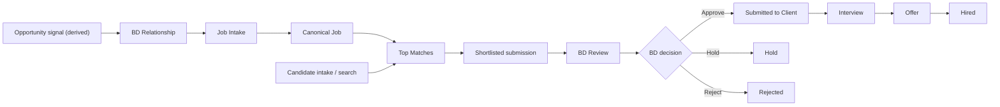

The strongest connected chain is:

`Job Intake -> Job -> Top Matches -> Shortlist -> BD Review -> Submitted -> Interview -> Offer -> Hired`

The weakest boundary is:

`Opportunity -> BD Relationship -> Job Intake`

This boundary is navigation-led rather than entity-led. Terrer has no canonical opportunity/deal record linking a company, contact, job request, owner, value, and stage.

---

## 1. Opportunity Workflows

### O1. Discover and Prioritize an Account

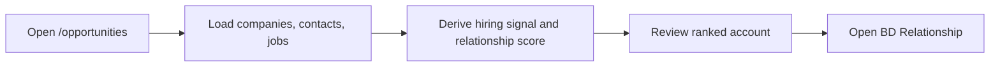

| Field | Detail |
|---|---|
| Start point | `/opportunities`, normally from BD sidebar |
| End point | Selected company opened in `/bd-relationships` |
| Tables touched | Read: `companies`, `bd_contacts`, `jobs` |
| Actions available | Review top companies; inspect priority queue; review follow-ups due; open a selected relationship account |
| Missing steps | Assign owner; qualify opportunity; record opportunity stage/value/probability; dismiss/defer signal; create task directly; convert signal into job intake |
| Dead ends | All ranking cards are read-only except “Open Relationship.” No opportunity record is created or updated. |

### O2. Opportunity-to-Relationship Handoff

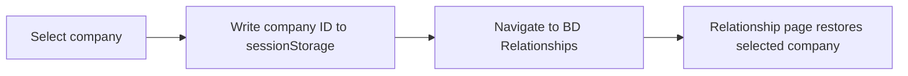

| Field | Detail |
|---|---|
| Start point | Any company action in `/opportunities` |
| End point | Expanded company workspace in `/bd-relationships` |
| Tables touched | None during transition; destination later reads `companies`, `bd_contacts`, `bd_notes`, `jobs` |
| Actions available | Open relationship context |
| Missing steps | Stable URL parameter; persisted selection; direct deep link; recorded “opportunity viewed” activity |
| Dead ends | The handoff relies on `sessionStorage`. It is not shareable, auditable, or durable across browser sessions. |

### O3. “Create Opportunity” from a Relationship

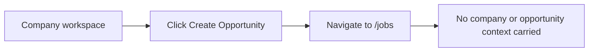

| Field | Detail |
|---|---|
| Start point | Expanded account in `/bd-relationships` |
| End point | Generic `/jobs` page |
| Tables touched | None |
| Actions available | Navigation only |
| Missing steps | Create opportunity record; carry company/contact context; choose existing market job or start job intake; assign BD/recruiter owner; set stage and next action |
| Dead ends | **Misleading action.** “Create Opportunity” does not create anything and does not open Job Intake. |

---

## 2. BD Relationship Workflows

### B1. Create Company and Contact

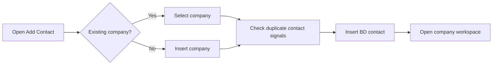

| Field | Detail |
|---|---|
| Start point | “Add Contact” in `/bd-relationships` |
| End point | New contact persisted and its company expanded |
| Tables touched | Insert: `companies` when needed; insert: `bd_contacts` |
| Actions available | Select/create company; enter contact details; set relationship status; set next action/date; add notes; review duplicates; continue despite duplicate warning |
| Missing steps | Company-domain normalization; enforced duplicate merge; owner assignment; contact consent/legal basis; activity event for creation |
| Dead ends | Duplicate override can create parallel records. LinkedIn URL is embedded in notes instead of a dedicated field. |

### B2. Maintain Contact and Relationship Status

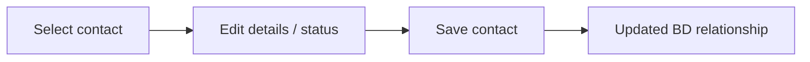

| Field | Detail |
|---|---|
| Start point | Contact within an expanded account |
| End point | Updated contact record |
| Tables touched | Update: `bd_contacts` |
| Actions available | Edit name, title, email, phones, status, notes; mark contacted; mark responded |
| Missing steps | Controlled status taxonomy; status-transition rules; activity timeline; previous-value history; owner and team visibility |
| Dead ends | Status is a loose string. “Responded” does not automatically create a next action, qualification step, or opportunity. |

### B3. Schedule and Execute Follow-up

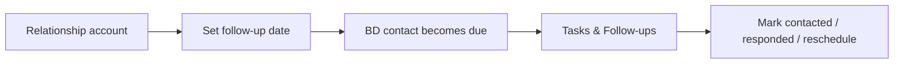

| Field | Detail |
|---|---|
| Start point | Contact action in `/bd-relationships` or `/bd-tasks` |
| End point | Contact updated with new status, note, or next action |
| Tables touched | Update: `bd_contacts` |
| Actions available | Set follow-up date; mark contacted; mark responded; edit next action; log a contact note |
| Missing steps | Canonical task record; completion status; reminders; recurring follow-up; assigned owner; outcome taxonomy |
| Dead ends | Task history is overwritten in contact fields. Marking responded can leave the contact without a next action. |

### B4. Log Account Note

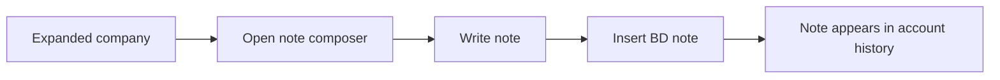

| Field | Detail |
|---|---|
| Start point | Expanded company workspace |
| End point | Account note visible in relationship history |
| Tables touched | Insert: `bd_notes`; read: `bd_notes` |
| Actions available | Create general company note |
| Missing steps | Edit/delete note; contact-specific note selection; structured activity type; attachments; follow-up creation from note |
| Dead ends | “Log Activity” navigates to Tasks rather than opening a contextual activity composer. |

### B5. Maintain Company Hiring-Source Intelligence

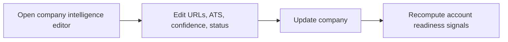

| Field | Detail |
|---|---|
| Start point | Company workspace in `/bd-relationships` |
| End point | Updated source-intelligence fields on company |
| Tables touched | Update: `companies` |
| Actions available | Edit website, LinkedIn, careers URL, ATS family, source confidence/status/notes |
| Missing steps | Automated verification; scheduled re-check; source evidence; change history; confidence calibration |
| Dead ends | Updating intelligence does not trigger scraping, enrichment, or a new opportunity workflow. |

---

## 3. Job Intake Workflows

### J1. Parse Messy Job Input

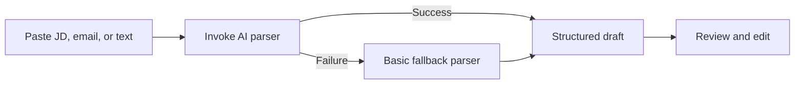

| Field | Detail |
|---|---|
| Start point | `/job-intake` from dashboard, jobs, or BD navigation |
| End point | Editable structured job draft in browser state |
| Tables touched | None; Edge Function: `job-intake-parser` |
| Actions available | Load example; paste text; extract; review parser source/confidence; edit fields |
| Missing steps | URL fetching; attachment parsing; duplicate job check; company/contact matching; explicit must-have versus nice-to-have requirements |
| Dead ends | A parsed draft is not autosaved. Leaving the page loses it. |

### J2. Save Canonical Job

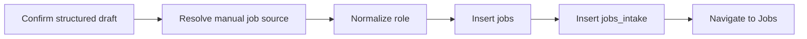

| Field | Detail |
|---|---|
| Start point | Confirm & Save in Job Intake |
| End point | Active operational job listed in `/jobs` |
| Tables touched | Read: `job_sources`; insert: `jobs`; insert: `jobs_intake` |
| Actions available | Save edited job; create active operational record |
| Missing steps | Link company ID/contact/opportunity; assign recruiter/BD owner; set urgency/SLA; add structured `job_requirements`; choose operational status; navigate directly to Top Matches |
| Dead ends | If `jobs` insert succeeds but `jobs_intake` insert fails, an orphan canonical job can remain. There is no transaction or compensating delete. |

### J3. Job-to-Execution Handoff

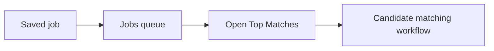

| Field | Detail |
|---|---|
| Start point | Successful job save |
| End point | Top Matches for selected job, after a separate user action |
| Tables touched | Read/update: `jobs`; read: `submissions` |
| Actions available | Search job; change operational status; open Top Matches |
| Missing steps | Post-save success page; direct “Start matching”; intake completeness check; recruiter assignment; source strategy generation |
| Dead ends | The save redirects to the general Jobs list, so context and momentum are lost. |

---

## 4. Candidate Workflows

### C1. Search and Review Candidate Pool

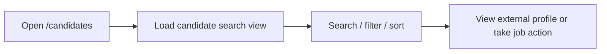

| Field | Detail |
|---|---|
| Start point | Candidate sidebar or Top Matches sourcing handoff |
| End point | Candidate reviewed, externally opened, locally added, or shortlisted |
| Tables touched | Read: `vw_candidate_search_clean`, `candidates`, `submissions` through shared store |
| Actions available | Search; role filter; job selection; view LinkedIn/GitHub; inspect structured profile fields |
| Missing steps | Native candidate profile navigation from this page; saved filters; ownership; candidate status management; edit/archive/merge |
| Dead ends | “View Profile” opens only LinkedIn/GitHub. Candidates without a source URL produce an alert and no internal profile fallback. |

### C2. Manual / URL / Pasted-Resume Candidate Intake

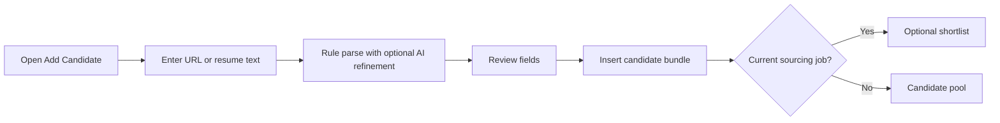

| Field | Detail |
|---|---|
| Start point | “Add Candidate” in `/candidates` |
| End point | Candidate in canonical pool; optionally shortlisted to current job |
| Tables touched | Insert: `candidates`, `candidate_scores`, `source_profiles`, `candidate_skills`; optional upsert: `submissions`; Edge Function may be used for AI refinement |
| Actions available | Detect source; parse pasted resume; edit suggestions; save; add-and-shortlist when job context exists |
| Missing steps | Duplicate detection before insert; transactional RPC; consent capture; structured salary/notice fields; automatic internal profile opening |
| Dead ends | Skill insert failure is tolerated, leaving a candidate with weaker matching data. Candidate creation rollback is client-managed rather than atomic. |

### C3. Resume File Intake from Candidate Page

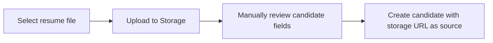

| Field | Detail |
|---|---|
| Start point | File tab in Add Candidate modal |
| End point | Candidate saved with resume path referenced in source data/notes |
| Tables touched | Storage: `candidate-resumes`; insert: `candidates`, `candidate_scores`, `source_profiles`, optionally `candidate_skills` |
| Actions available | Upload file; manually complete fields; save candidate |
| Missing steps | Resume text extraction on this page; parse progress; link `resume_file_path` directly on candidate; orphan-file cleanup when candidate insert fails |
| Dead ends | The UI explicitly states file parsing is not automated. A successful upload followed by candidate-save failure can leave an orphaned file. |

### C4. Admin Bulk Resume Import

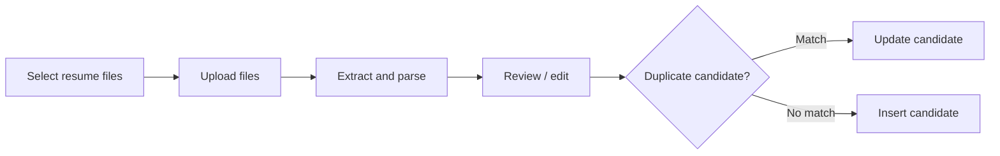

| Field | Detail |
|---|---|
| Start point | `/admin-resume-import` |
| End point | Candidate inserted or updated |
| Tables touched | Storage: `candidate-resumes`; read/insert/update: `candidates` |
| Actions available | Bulk upload; parse; inspect extraction diagnostics; edit; save |
| Missing steps | Create/update `candidate_scores`, `source_profiles`, and normalized skill relationships consistently; attach to job; create submission; post-import queue |
| Dead ends | Imported candidates stop in the pool. There is no direct handoff to Top Matches or a selected job. |

### C5. Add Existing Candidate to Job

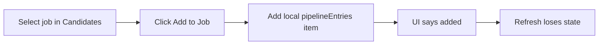

| Field | Detail |
|---|---|
| Start point | Suggested/all candidate card in generic `/candidates` flow |
| End point | Local browser state marked `identified` |
| Tables touched | None |
| Actions available | Select one of several mock/local job options; add candidate |
| Missing steps | Load real jobs; create canonical submission; persist identified stage; show in Pipeline; prevent cross-session duplication |
| Dead ends | **Critical dead end.** “Added to selected job” is not persisted and does not enter Top Matches or Pipeline. |

### C6. Contextual Shortlist from Top Matches

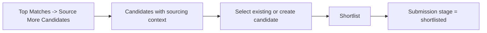

| Field | Detail |
|---|---|
| Start point | Top Matches sourcing-plan action |
| End point | Candidate/job submission persisted as `shortlisted` |
| Tables touched | Read: candidates; optional candidate inserts; upsert: `submissions` |
| Actions available | Filter by role context; shortlist existing candidate; create and shortlist new candidate |
| Missing steps | Sourcing context in URL; return-to-job action; persisted sourcing campaign/channel attribution |
| Dead ends | Context is in React navigation state, not the URL. Refreshing `/candidates` loses the selected job context. |

### C7. Inbound Interested Candidate Triage

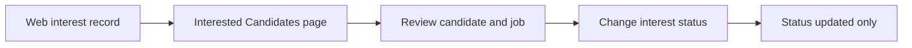

| Field | Detail |
|---|---|
| Start point | Record in `web_job_interest` |
| End point | Interest status set to reviewed, contacted, shortlisted, or rejected |
| Tables touched | Read/update: `web_job_interest`; read: `candidates`, `jobs` |
| Actions available | Review and change status |
| Missing steps | Create/link candidate if missing; create submission when shortlisted; assign recruiter; contact workflow; representation approval |
| Dead ends | Setting status to `shortlisted` does not create a `submissions` record, so the candidate does not enter Pipeline. |

---

## 5. Top Matches Workflows

### T1. Load and Rank Candidates for a Job

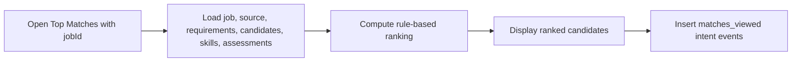

| Field | Detail |
|---|---|
| Start point | Jobs, Active Jobs, Hiring Intelligence, or direct `/top-matches?jobId=...` |
| End point | Ranked candidate list and sourcing plan |
| Tables touched | Read: `jobs`, `job_sources`, `job_requirements`, `candidate_skills`, `skills`, `vw_candidate_search_clean`, `ai_assessments`, `submissions`; insert: `candidate_intent_events` |
| Actions available | Review ranking, strengths/gaps, trust messaging, and existing stages |
| Missing steps | Persist ranking snapshot; explain scoring weights; recruiter override; exclude/dismiss candidate; pagination for large pools |
| Dead ends | Opening Top Matches without a job produces a selection/empty state rather than a workflow. |

### T2. Run Terrer AI Review

```mermaid
flowchart LR
    A["Candidate card"] --> B["Run Terrer AI Review"]
    B --> C["Generate deterministic review"]
    C --> D["Upsert AI assessment"]
    D --> E["Display recommendation"]
```

| Field | Detail |
|---|---|
| Start point | Candidate card in Top Matches |
| End point | Persisted assessment for candidate/job pair |
| Tables touched | Read/upsert: `ai_assessments` |
| Actions available | Generate/re-run review; inspect summary, strengths, concerns, recommendation, confidence |
| Missing steps | Real model call; reviewer identity; model/prompt provenance; approval/override; assessment version history |
| Dead ends | Assessment write errors are logged but not surfaced clearly. The persisted model is explicitly `mock_terrer_ai_review`. |

### T3. Shortlist Candidate

```mermaid
flowchart LR
    A["Click Shortlist"] --> B["Insert interest_clicked event"]
    B --> C["Upsert submission"]
    C --> D["Stage = shortlisted"]
    D --> E["Candidate appears in Pipeline"]
```

| Field | Detail |
|---|---|
| Start point | Candidate card in Top Matches |
| End point | Canonical submission at `shortlisted` |
| Tables touched | Insert: `candidate_intent_events`; upsert: `submissions` |
| Actions available | Shortlist once; stage badge updates |
| Missing steps | Shortlist reason; owner; next action/date; candidate consent/availability check |
| Dead ends | Failed shortlist is only logged by the generic handler; the user receives no explicit failure message. |

### T4. Send Candidate to BD Review

```mermaid
flowchart LR
    A["Click Send to BD Review"] --> B["Generate submission output"]
    B --> C["Recruiter adds notes"]
    C --> D["Upsert submission"]
    D --> E["Stage = ready_for_bd_review"]
    E --> F["BD Review Queue"]
```

| Field | Detail |
|---|---|
| Start point | Any eligible candidate card, including a candidate not previously shortlisted |
| End point | Candidate appears in `/bd-queue` |
| Tables touched | Upsert: `submissions`; optional read: `ai_assessments` for review content |
| Actions available | Preview generated summary; add notes; send to BD |
| Missing steps | Enforce shortlist/recruiter-review prerequisite; select BD owner/client contact; validate candidate consent; attach resume; notify BD |
| Dead ends | A candidate can skip `shortlisted` and go directly from no submission to BD Review. No notification or assignment is created. |

### T5. Source More Candidates

```mermaid
flowchart LR
    A["Sourcing plan"] --> B["Update channel tracker"]
    A --> C["Open Candidates with job context"]
    C --> D["Find/create and shortlist"]
```

| Field | Detail |
|---|---|
| Start point | Sourcing Plan tab in Top Matches |
| End point | Either local channel state changed or Candidates page opened with sourcing context |
| Tables touched | Channel updates: none; candidate sourcing path may later touch candidate tables and `submissions` |
| Actions available | Change channel status; search internal candidates; open candidate sourcing flow |
| Missing steps | Persist sourcing channel; sourcing owner; query; run date; results; attribution; external sourcing launch |
| Dead ends | Channel tracker is local-only and resets on refresh. |

### T6. View Candidate Profile

```mermaid
flowchart LR
    A["Candidate card"] --> B["Open Candidate Profile"]
    B --> C["Review candidate, sources, resume, stage"]
    C --> D["Return to Top Matches"]
```

| Field | Detail |
|---|---|
| Start point | “View Profile” in Top Matches |
| End point | Return to same job's Top Matches |
| Tables touched | Read: `candidates`, `source_profiles`, `submissions`, `jobs`, `vw_candidate_search_clean`; Storage: `candidate-resumes` |
| Actions available | Review profile; open source/resume links; return |
| Missing steps | Edit candidate; shortlist/send from profile; activity timeline; compare candidates |
| Dead ends | Profile is read-only and cannot advance the workflow. |

---

## 6. Pipeline Workflows

### P1. Submission Lifecycle

```mermaid
stateDiagram-v2
    [*] --> Shortlisted
    Shortlisted --> BDReview: Recruiter sends
    BDReview --> Submitted: BD approves
    BDReview --> Hold: BD holds
    BDReview --> Rejected: BD rejects
    Submitted --> Interview
    Submitted --> Rejected
    Interview --> Offer
    Interview --> Rejected
    Offer --> Hired
    Offer --> Rejected
    Hold --> Shortlisted: Admin reset
    Rejected --> Shortlisted: Admin reset
    Hired --> Offer: Admin reset
```

| Field | Detail |
|---|---|
| Start point | Submission created by Top Matches or contextual Candidates shortlist |
| End point | `hired`, `rejected`, or `hold`; admins can reset or delete |
| Tables touched | Read/update/upsert/delete: `submissions`; read: `jobs`, `vw_candidate_search_clean` |
| Actions available | Search/select submissions; send shortlisted to BD Review; progress submitted to interview/reject; interview to offer/reject; offer to hired/reject; admin reset/delete |
| Missing steps | Interview scheduling; offer details; placement record; fees/revenue; reason codes; stage history; notifications; owner; next-action editor |
| Dead ends | `new` has no normal action. `ready_for_bd_review` requires the separate BD Queue. `hold`, `rejected`, and `hired` are terminal for non-admin users. |

### P2. Shortlisted-to-BD Handoff from Pipeline

```mermaid
flowchart LR
    A["Select shortlisted submission"] --> B["Write recruiter note"]
    B --> C["Send to BD Review"]
    C --> D["Update submission stage and note"]
    D --> E["BD Queue"]
```

| Field | Detail |
|---|---|
| Start point | Shortlisted row in `/pipeline` |
| End point | `ready_for_bd_review` submission |
| Tables touched | Update: `submissions` |
| Actions available | Add note and send |
| Missing steps | Generate/refresh submission output; select BD reviewer; notify reviewer; validate required fields |
| Dead ends | Notes typed for stages other than shortlisted have no save action and remain local drafts. |

### P3. BD Review Decision

```mermaid
flowchart LR
    A["Open /bd-queue"] --> B["Review candidate package"]
    B --> C{"Decision"}
    C -->|Approve| D["submitted_to_client"]
    C -->|Hold| E["hold"]
    C -->|Reject| F["rejected"]
```

| Field | Detail |
|---|---|
| Start point | Submission at `ready_for_bd_review` |
| End point | Submitted, hold, or rejected |
| Tables touched | Read: `submissions`, `jobs`, `ai_assessments`, candidate search view; update: `submissions` |
| Actions available | Expand details; copy submission output; approve; reject; hold; refresh queue |
| Missing steps | Decision reason; selected client/contact; communication send/log; notification to recruiter; scheduled next action |
| Dead ends | “Approve” only changes stage. It does not send anything to a client. “Copy” has no activity log. Hold/reject have no recovery path for BD users. |

### P4. Client Progression

```mermaid
flowchart LR
    A["submitted_to_client"] --> B["Mark Interview or Reject"]
    B --> C["interview"]
    C --> D["Mark Offer or Reject"]
    D --> E["offer"]
    E --> F["Mark Hired or Reject"]
```

| Field | Detail |
|---|---|
| Start point | Approved submission |
| End point | Hired or rejected |
| Tables touched | Update: `submissions` |
| Actions available | Progress stage through interview, offer, and hired |
| Missing steps | Client feedback; interview date/panel; offer salary/start date; placement ownership; fee invoice; candidate acceptance; rejection reasons |
| Dead ends | Stage changes are the only recorded events. There is no placement entity or commercial close workflow after `hired`. |

### P5. Pipeline Administration

```mermaid
flowchart LR
    A["Admin selects submission/job"] --> B{"Reset or delete?"}
    B -->|Reset| C["Update stage"]
    B -->|Delete| D["Delete submission"]
```

| Field | Detail |
|---|---|
| Start point | Pipeline detail or Top Matches admin controls |
| End point | Submission reset to earlier stage or removed |
| Tables touched | Update/delete: `submissions` |
| Actions available | Per-record reset/delete; bulk reset/delete by job |
| Missing steps | Audit record; soft delete; reason; restore; production/test-data distinction |
| Dead ends | Destructive operations are direct database changes with browser confirmation only. |

---

## Cross-Workflow Gaps

| Priority | Gap | Workflow impact |
|---|---|---|
| Critical | No canonical opportunity/deal entity | Opportunity and BD Relationship cannot reliably convert account activity into owned, measurable revenue workflow. |
| Critical | Generic Candidate “Add to Job” is local-only | Candidate appears added but never reaches Top Matches or Pipeline. |
| Critical | BD approval does not send or log client communication | `submitted_to_client` can be factually inaccurate. |
| High | Job Intake is not linked to company/contact/opportunity | Commercial origin and recruiter delivery become disconnected. |
| High | Inbound interest “shortlisted” does not create submission | Marketplace demand does not enter recruiter operations. |
| High | Hold/reject recovery is admin-only | Normal BD/recruiter users cannot reopen legitimate workflows. |
| High | No stage/activity history | Current state is visible, but operational accountability and conversion analysis are weak. |
| Medium | Sourcing channels and candidate context are local state | Refreshing can erase sourcing progress or job context. |
| Medium | Candidate creation and job creation use client-side multi-write sequences | Partial failure can create orphan or incomplete records. |
| Medium | Hired is not converted into placement/revenue records | The core placement-business outcome is not operationalized. |

## Recommended Target Workflow

```mermaid
flowchart LR
    A["Hiring signal"] --> B["Qualified opportunity"]
    B --> C["Company + stakeholder"]
    C --> D["Job intake linked to opportunity"]
    D --> E["Assigned operational job"]
    E --> F["Candidate sourcing"]
    F --> G["Shortlist with consent"]
    G --> H["Terrer AI Review"]
    H --> I["BD approval + client/contact selection"]
    I --> J["Logged client submission"]
    J --> K["Interview event"]
    K --> L["Offer event"]
    L --> M["Placement"]
    M --> N["Fee / revenue tracking"]
```

This target preserves Terrer's current working recruiter chain while adding the missing commercial and audit entities around it.
